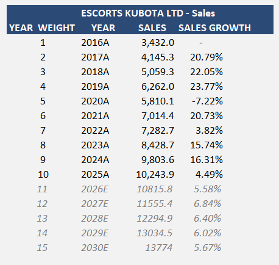
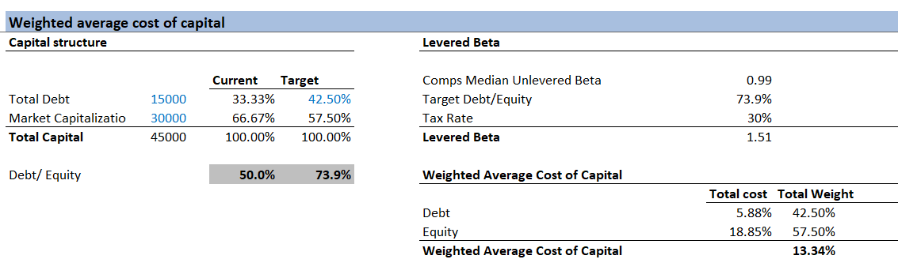
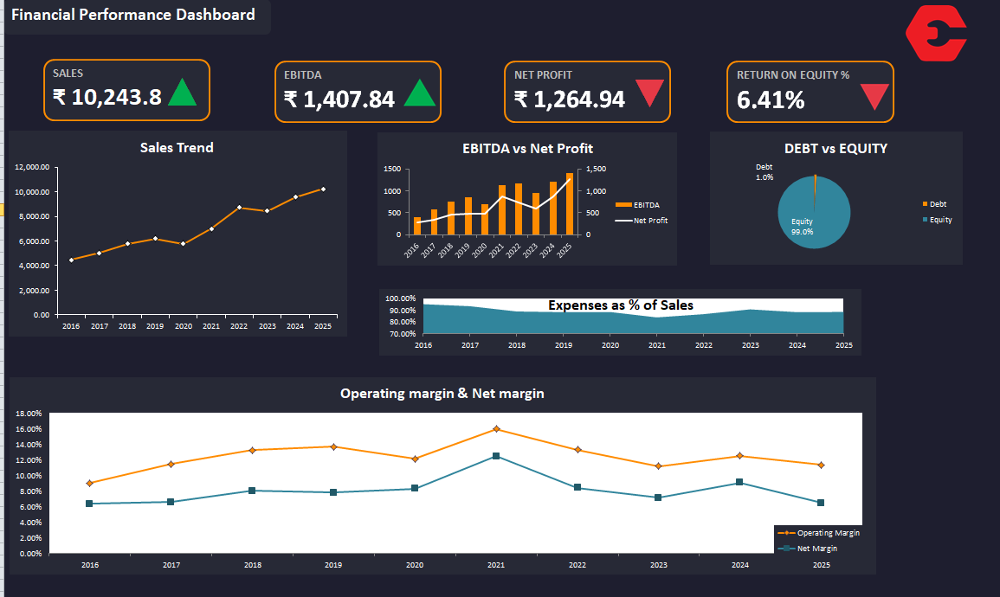

# 📊 Financial Modelling & Analysis

## 🎯 Project Objective
This project focuses on building a complete financial model to analyze company performance, evaluate financial health, and forecast future trends.  
The model combines financial statement analysis, ratio analysis, forecasting, and dashboard visualization to support data-driven financial decision-making.

---

## 🛠 Tools Used
- Excel (Financial Modelling & Dashboards)
- Financial Statement Analysis
- Forecasting Techniques
- Ratio Analysis
- WACC Calculation

---

## 📂 Project Workflow
1. Historical financial statement analysis  
2. Revenue and sales forecasting  
3. Cost structure and margin analysis  
4. WACC calculation and capital structure analysis  
5. Financial ratio analysis  
6. Cash flow analysis  
7. Dashboard creation for KPI visualization  

---

## 📈 Sales Forecasting
Revenue projections were created using historical sales trends to estimate future performance and growth rates.

### Forecasting Preview

---

## 💰 Weighted Average Cost of Capital (WACC)
The model calculates WACC using:

- Capital structure (Debt vs Equity)
- Levered Beta
- Tax rate
- Cost of debt and equity

### WACC Analysis

---

## 📊 Financial Dashboards

### 📈 Financial Performance Dashboard
This dashboard summarizes key financial metrics including:

- Sales
- EBITDA
- Net Profit
- Return on Equity (ROE)
- Operating Margin
- Expense Trends

---

### 📉 Key Ratios Dashboard
This dashboard highlights company financial health through:

- ROE vs ROCE
- Debt–Equity Ratio
- Interest Coverage Ratio
- Cash Conversion Cycle
- Margin Analysis

---

## 📁 Financial Model File
Download the complete Excel financial model:

[Download Financial Model](financial-model.xlsx)

---

## 🔎 Key Financial Analysis Performed
- Revenue growth analysis  
- Profitability & margin analysis  
- Capital structure evaluation  
- Ratio analysis (Profitability, Efficiency, Liquidity)  
- Cash flow trend analysis  
- Forecast modelling  

---

## 💼 Business Impact
This financial model helps:

- Evaluate company financial performance  
- Identify profitability and risk trends  
- Support valuation and investment analysis  
- Improve financial decision-making using data-driven insights  

---

## 🚀 Key Skills Demonstrated
- Financial Modelling
- Forecasting
- Financial Statement Analysis
- KPI Dashboard Design
- Ratio & Performance Analysis
