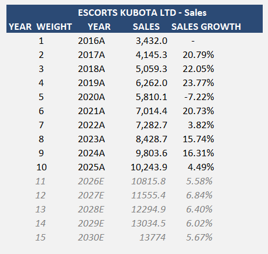
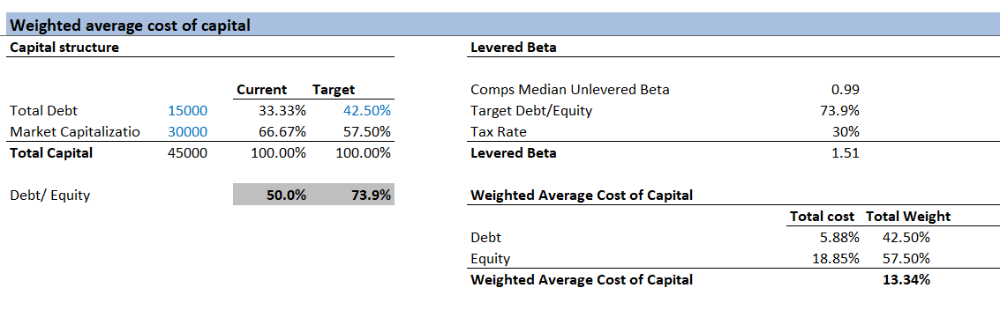
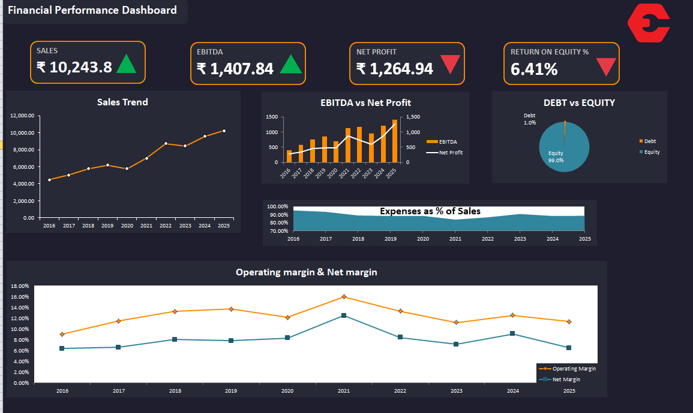
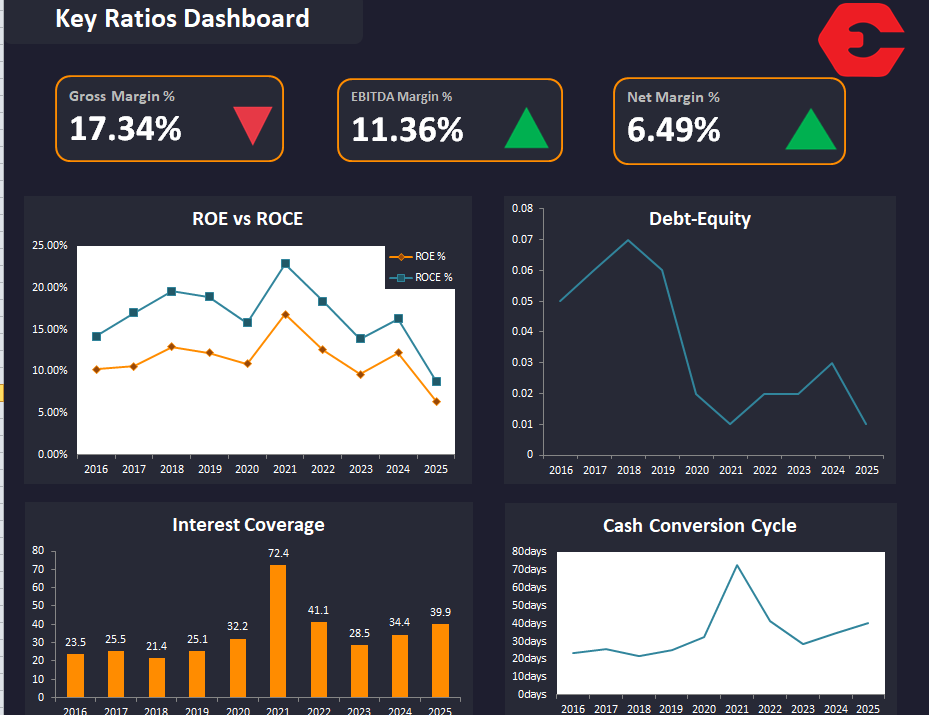

# 📊 Financial Modeling & Analysis – Escorts Kubota Ltd

## 🎯 Project Objective
This project involves building a comprehensive and integrated financial model to analyze company performance, evaluate financial health, and forecast future trends.

The model combines 3-statement financial modeling, forecasting, WACC estimation, sensitivity analysis, and dashboard visualization to support data-driven financial decision-making.

---

## 🛠 Tools Used
- Microsoft Excel (Advanced Financial Modeling)
- Financial Statement Analysis  
- Regression Analysis (Beta Calculation)  
- Forecasting Techniques  
- Ratio & Trend Analysis  
- Sensitivity & Scenario Analysis  

---

## 📂 Model Structure
1. Historical Financial Statements (Income Statement, Balance Sheet, Cash Flow)  
2. Forecasting Model (2026–2030)  
3. Beta Calculation (Regression Analysis)  
4. WACC Calculation (CAPM-based)  
5. Ratio & Trend Analysis  
6. Variance Analysis (Actual vs Forecast)  
7. Sensitivity & Scenario Analysis  
8. Financial Dashboards  

---

## 📈 Forecasting Model
Revenue projections are based on historical trends with a declining growth assumption to reflect business maturity.

### Forecasting Preview

---

## 💰 Cost of Capital (WACC)
WACC is calculated using:
- Beta estimation via regression  
- Capital structure analysis  
- CAPM for cost of equity  
- After-tax cost of debt  

### WACC Analysis

---

## 📊 Financial Dashboards

### 📈 Financial Performance Dashboard
- Sales, EBITDA, Net Profit  
- Operating & Net Margins  
- Expense Trends  
- Return on Equity (ROE)  

---

### 📉 Key Ratios Dashboard
- ROE vs ROCE  
- Debt–Equity Ratio  
- Interest Coverage Ratio  
- Cash Conversion Cycle  
- Margin Analysis  

---

## 🔍 Advanced Analysis

### Regression-Based Beta
- Beta calculated using stock vs market returns  
- Adjusted beta applied  

### Variance Analysis
- Actual vs Forecast comparison  
- Best & Worst case scenarios  

### Sensitivity Analysis
- WACC sensitivity  
- Net Profit sensitivity  
- EPS sensitivity  

---

## 📁 Financial Model File
[Download Financial Model](financial-model.xlsx)

---

## 🔎 Key Insights
- Revenue growth stabilizing over time  
- Profit influenced by non-operating income  
- Strong capital efficiency  
- Margins show cyclical movement  

---

## 💼 Business Impact
- Helps evaluate company performance  
- Identifies profitability and risk drivers  
- Supports financial and investment decisions  
- Enables scenario-based planning  

---

## 🚀 Key Skills Demonstrated
- 3-Statement Financial Modeling  
- Forecasting  
- WACC Calculation  
- Regression Analysis  
- Sensitivity & Scenario Analysis  
- Financial Statement Analysis  
- Dashboard Design  

---

## 🔮 Future Improvements
- Add DCF Valuation  
- Add Comparable Company Analysis  
- Build valuation dashboard  
