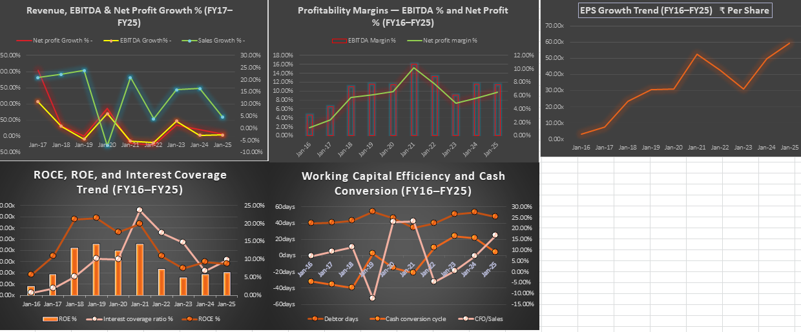
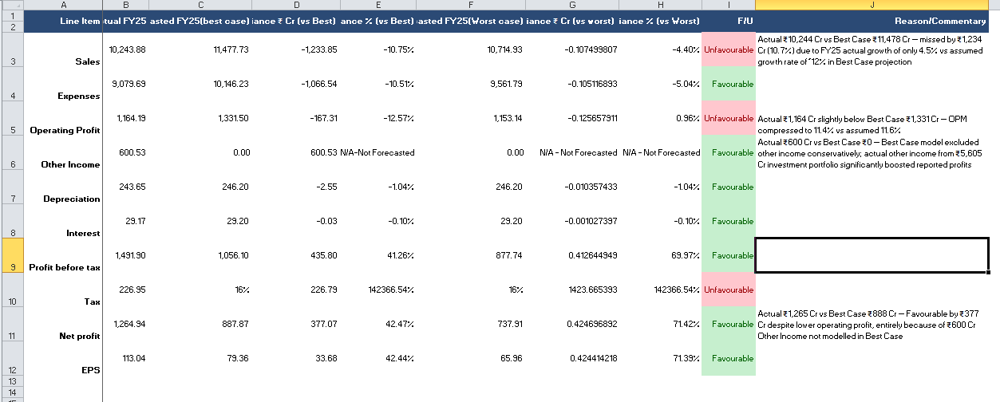
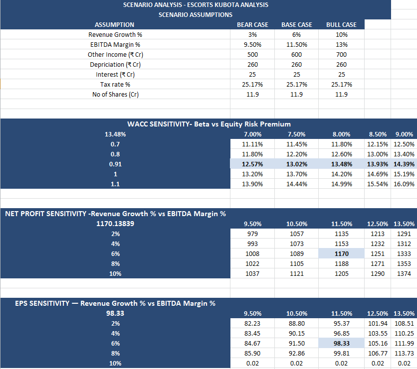
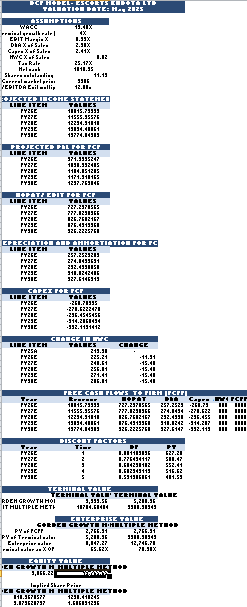

# 📊 Financial Modeling & Valuation Analysis – Escorts Kubota Ltd.

## 🎯 Project Objective

Developed a comprehensive financial model for Escorts Kubota Ltd. to analyze historical performance, forecast future financials, estimate intrinsic value, and evaluate key business drivers.

The model integrates forecasting, ratio analysis, WACC estimation, DCF valuation, variance analysis, sensitivity testing, and interactive dashboards to support investment research and financial decision-making.

---

## 🛠 Tools Used

- Microsoft Excel
- Financial Modeling
- Financial Statement Analysis
- Forecasting Techniques
- Ratio Analysis
- WACC Calculation
- DCF Valuation
- Sensitivity & Scenario Analysis
- Dashboard Design

---

## 📂 Model Structure

1. Historical Financial Statement Analysis
2. Ratio Analysis
3. Revenue & Earnings Forecasting
4. Beta Calculation
5. WACC Estimation
6. Variance Analysis
7. Trend Analysis
8. Sensitivity & Scenario Analysis
9. Discounted Cash Flow (DCF) Valuation
10. Financial Dashboards

---

## 📈 Forecasting Model

Future financial performance is projected using historical growth trends, operating assumptions, and margin analysis.

Key forecasted metrics include:

- Revenue
- EBITDA
- EBIT
- Net Profit
- Earnings Per Share (EPS)

### Forecasting Dashboard

---

## 💰 Weighted Average Cost of Capital (WACC)

The model estimates the company's cost of capital using:

- CAPM-based Cost of Equity
- Cost of Debt Analysis
- Capital Structure Weights
- Beta Estimation
- Market Risk Premium
- Risk-Free Rate

### WACC Analysis

---

## 📊 Financial Dashboards

### Financial Performance Dashboard

Tracks key performance indicators including:

- Revenue Growth
- EBITDA Growth
- Net Profit Growth
- EBITDA Margin
- Net Profit Margin
- EPS Growth

---

### Key Ratios Dashboard

Analyzes critical financial metrics such as:

- Return on Equity (ROE)
- Return on Capital Employed (ROCE)
- Interest Coverage Ratio
- Debtor Days
- Cash Conversion Cycle
- CFO-to-Sales Ratio

---

## 📉 Trend Analysis

Conducted a 10-year trend analysis (FY16–FY25) to evaluate the company's long-term operational and financial performance.

Key metrics analyzed:

- Sales Growth
- Net Profit Growth
- EBITDA Margin
- Net Profit Margin
- ROCE
- ROE
- Interest Coverage Ratio
- Working Capital Metrics
- Cash Flow Quality
- EPS Growth

### Trend Analysis

---

## 📋 Variance Analysis

Compared FY25 actual results against projected best-case and worst-case scenarios to assess forecasting accuracy and identify key performance drivers.

The analysis highlights:

- Revenue Variance
- Expense Variance
- Operating Profit Variance
- Net Profit Variance
- EPS Variance
- Forecast Accuracy Commentary

### Variance Analysis

---

## 🎯 Sensitivity & Scenario Analysis

Evaluated how changes in key assumptions impact earnings and valuation.

Variables tested:

- Revenue Growth Rate
- EBITDA Margin
- Cost of Debt
- WACC
- Terminal Growth Rate

Outputs analyzed:

- Net Profit
- EPS
- Valuation Impact

### Sensitivity Analysis

---

## 💵 Discounted Cash Flow (DCF) Valuation

Estimated the intrinsic value of Escorts Kubota using the Free Cash Flow to Firm (FCFF) approach.

### DCF Components

- Revenue Forecasting
- EBITDA Forecasting
- Free Cash Flow Calculation
- Terminal Value Estimation
- Discount Factor Computation
- Enterprise Value Calculation
- Equity Value Calculation
- Implied Share Price

### DCF Valuation Model

---

## 🔎 Key Insights

- Revenue growth has moderated in recent years, reflecting business maturity.
- EBITDA margins expanded significantly over the last decade through operational efficiency improvements.
- EPS demonstrated strong long-term growth despite cyclical fluctuations.
- Interest coverage improved substantially, indicating stronger debt-servicing capacity.
- Cash flow quality strengthened as CFO/Sales improved over time.
- Valuation remains highly sensitive to assumptions regarding growth and discount rates.

---

## 💼 Business Impact

This model helps:

- Evaluate company performance and financial health.
- Identify profitability and value drivers.
- Assess investment opportunities.
- Support equity research and valuation exercises.
- Enable scenario-based strategic planning.
- Improve capital allocation and decision-making.

---

## 🚀 Skills Demonstrated

- Financial Modeling
- 3-Statement Modeling
- DCF Valuation
- WACC Calculation
- CAPM Analysis
- Forecasting & Projections
- Financial Statement Analysis
- Ratio Analysis
- Trend Analysis
- Variance Analysis
- Sensitivity Analysis
- Scenario Modeling
- Corporate Finance
- Equity Research
- Dashboard Design

---

## 📁 Project Files

- Financial Model (Excel)
- Forecasting Model
- WACC Analysis
- Financial Performance Dashboard
- Ratio Dashboard
- Trend Analysis
- Variance Analysis
- Sensitivity Analysis
- DCF Valuation Model

---

## 👨‍💼 Author

Pratha Jain

Finance | Financial Modeling | Valuation | Equity Research
